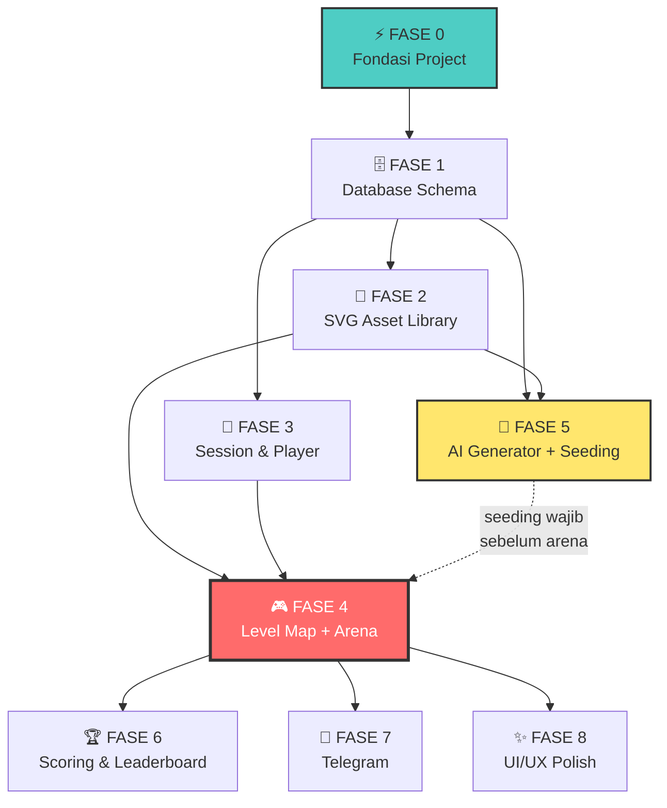

# 🌅 Dunia Anin — Implementation Plan v4 FINAL (SDUI + TALL Stack + Nvidia NIM)

> **Project**: Dunia Anin — Game Edukasi SDUI untuk Anak Usia ≤ 7 Tahun
> **Stack**: Laravel 12, Livewire 4, Alpine.js, Tailwind CSS, Nvidia NIM
> **AI Model**: `meta/llama-3.1-70b-instruct`
> **Database**: MySQL (InnoDB) via Laragon | Queue Driver: `database`
> **Orientasi**: Landscape-locked (horizontal)
> **Deployment**: Laragon (dev) → Shared Hosting (prod)
> **Status**: ✅ **READY TO BUILD** — Semua keputusan desain telah final
> **Tanggal**: 18 Maret 2026

---

## 📋 Semua Keputusan Desain (✅ ALL FINALIZED)

### Branding & Identitas
| Aspek | Keputusan |
|-------|-----------|
| **Nama Aplikasi** | **Dunia Anin** (singkat, 10 karakter, viewport-friendly) |
| **Target User** | Anak usia ≤ 7 tahun (prototipe untuk Anin) |
| **Visual Assets** | SVG inline, dikontrol dinamis via Alpine.js + Tailwind |
| **Game Engines v1** | 3 engine: `tap_collector`, `macro_dnd`, `binary_choice` |
| **Frontend Rendering** | Single `arena.blade.php` — SDUI pattern |
| **Audio** | ❌ Tidak ada di v1. Murni visual feedback (scale, shake, fade) |
| **Orientasi** | 🔒 Landscape-locked. Tidak ada layout portrait |

### 🎨 Color Palette — Sunset Theme
> Prinsip: **Background solid hangat, kontras ekstrem dengan objek interaktif.**
> Tidak ada gradient ramai. Anak butuh pembedaan jelas antara "bisa disentuh" vs "latar belakang".

| Role | Tailwind Class | Hex | Penggunaan |
|------|---------------|-----|------------|
| **Primary** | `amber-400` | `#FBBF24` | Tombol utama, node aktif (pulse), highlight |
| **Primary Dark** | `orange-500` | `#F97316` | Tombol pressed state, header accent |
| **Background** | `amber-50` | `#FFFBEB` | Latar belakang utama (solid, bukan gradient) |
| **Surface** | `orange-50` | `#FFF7ED` | Card, panel, zona interaktif |
| **Success** | `emerald-400` | `#34D399` | Node selesai, jawaban benar, confetti |
| **Error** | `rose-400` | `#FB7185` | Shake animation, flash salah |
| **Text Primary** | `amber-900` | `#78350F` | Judul, label utama |
| **Text Secondary** | `orange-700` | `#C2410C` | Sub-label, progress text |
| **Locked/Disabled** | `gray-300` | `#D1D5DB` | Node terkunci, elemen non-aktif |
| **Interactive Objects** | `(varies)` | — | SVG objek game: warna cerah (sky, emerald, rose, violet) untuk kontras TINGGI terhadap background amber |

### Infrastruktur
| Aspek | Keputusan |
|-------|-----------|
| **Database** | MySQL (InnoDB) — row-level locking untuk konkurensi Job + Livewire |
| **Queue Driver** | `database` — WAJIB async, tidak boleh `sync` |
| **AI Model** | `meta/llama-3.1-70b-instruct` via Nvidia NIM API |
| **Notifikasi** | Telegram Bot (token sudah tersedia) |
| **Admin Panel** | ❌ Tidak ada. Artisan command + Telegram |
| **Dev Environment** | Laragon (MySQL + PHP + Apache/Nginx) |
| **Production** | Shared Hosting |

### Gameplay Core Rules
| Aspek | Keputusan |
|-------|-----------|
| **Autentikasi** | Session-based. Username wajib. localStorage + DB |
| **Syarat Naik Level** | Akumulasi **3 jawaban benar** per level |
| **Jawaban Salah** | Infinite Reroll — soal langsung diganti, bukan retry |
| **Stok Habis** | Recycle acak dari kumpulan soal yang sama |
| **Level Provisioning** | Event-Driven via `PlayerLeveledUpEvent` |
| **Trigger Generate** | Jika `level_pemain >= max_level_tersedia - 2` |

### Difficulty Scaling
| Aspek | Keputusan |
|-------|-----------|
| **Horizontal (dalam 1 level)** | Parameter kognitif dikunci. Hanya variasi visual |
| **Vertikal (antar level)** | Naikkan kuantitas ATAU ganti engine, TIDAK keduanya |
| **Formula angka** | `$batasAngkaMax = 5 + floor($level / 2)` |
| **Formula spawn** | `$maxSpawn = min(3 + floor($level / 2), 10)` |
| **Engine Rotation** | `$enginePool[($level - 1) % 3]` |

### Screen Flow (Two-State Architecture)
| Aspek | Keputusan |
|-------|-----------|
| **State A** | Level Map — peta vertikal dari bawah ke atas |
| **State B** | Arena — SDUI game engine |
| **Transisi A→B** | Klik node aktif → `$wire.masukArena(level)` |
| **Transisi B→A** | 3 challenge selesai → simpan progres → kembali ke peta |
| **Render batas** | Level 1 sampai `current_level + 1` saja |
| **Auto-scroll** | `scrollIntoView()` ke node aktif saat kembali ke peta |

---

## 🏗️ Tahapan Pembangunan (9 Fase)

### FASE 0 — Fondasi Project
> Inisialisasi Laravel 12 + TALL Stack + konfigurasi environment

**Langkah-langkah:**
1. Install Laravel 12 fresh di folder `fun_game_ai`
2. Install & konfigurasi Livewire 4
3. Install & konfigurasi Tailwind CSS
4. Setup Alpine.js (bundled dengan Livewire 4)
5. Setup `.env`:
   ```
   DB_CONNECTION=mysql
   DB_DATABASE=fun_game_ai
   QUEUE_CONNECTION=database
   NVIDIA_NIM_API_KEY=xxx
   NVIDIA_NIM_MODEL=meta/llama-3.1-70b-instruct
   TELEGRAM_BOT_TOKEN=xxx
   TELEGRAM_CHAT_ID=xxx
   ```
6. Setup layout `app.blade.php`:
   - Google Fonts (Baloo 2 / Nunito)
   - Viewport meta landscape-optimized
   - CSS landscape lock via `@media (orientation: portrait)` rotate message
7. Buat queue migration: `php artisan queue:table && php artisan migrate`

**Deliverable:** Project Laravel yang berjalan di Laragon ✅

---

### FASE 1 — Database Schema & Model
> 3 tabel utama: players, questions, player_question_logs

```sql
-- players
CREATE TABLE players (
    id CHAR(26) PRIMARY KEY,          -- ULID
    username VARCHAR(50) UNIQUE NOT NULL,
    session_token VARCHAR(36) UNIQUE NOT NULL, -- UUID di localStorage
    current_level INT DEFAULT 1,
    total_score INT DEFAULT 0,
    challenges_completed INT DEFAULT 0,
    last_active_at TIMESTAMP NULL,
    created_at TIMESTAMP,
    updated_at TIMESTAMP
);

-- questions (bank soal dari AI)
CREATE TABLE questions (
    id CHAR(26) PRIMARY KEY,          -- ULID
    level INT NOT NULL,
    tipe_engine ENUM('tap_collector', 'macro_dnd', 'binary_choice') NOT NULL,
    payload JSON NOT NULL,            -- full game config dari AI
    difficulty INT DEFAULT 1,
    created_at TIMESTAMP,
    updated_at TIMESTAMP,
    INDEX idx_level (level),
    INDEX idx_engine (tipe_engine)
);

-- player_question_logs (catatan setiap interaksi)
CREATE TABLE player_question_logs (
    id BIGINT UNSIGNED AUTO_INCREMENT PRIMARY KEY,
    player_id CHAR(26) NOT NULL,
    question_id CHAR(26) NOT NULL,
    level_saat_main INT NOT NULL,
    is_correct BOOLEAN NOT NULL,
    score_earned INT DEFAULT 0,
    time_spent_ms INT NOT NULL,
    created_at TIMESTAMP,
    FOREIGN KEY (player_id) REFERENCES players(id),
    FOREIGN KEY (question_id) REFERENCES questions(id)
);
```

**Langkah-langkah:**
1. Buat 3 migration files
2. Buat 3 Eloquent Models + relationships
3. Jalankan `php artisan migrate`

**Deliverable:** Schema database siap ✅

---

### FASE 2 — SVG Asset Library
> Perpustakaan SVG inline yang dipanggil dinamis dari JSON AI

**Langkah-langkah:**
1. Buat Blade component `<x-svg-icon name="apel" />`
   - Resolve file dari `resources/views/components/svg/{name}.blade.php`
   - Support `class`, `width`, `height` attributes
   - Warna via `currentColor` → Tailwind `text-*` classes
2. Siapkan minimal 18 SVG icons:

   | Kategori | Icons |
   |----------|-------|
   | **Buah** | apel, pisang, jeruk, mangga, semangka |
   | **Hewan** | kucing, anjing, sapi, ayam, ikan, burung |
   | **Objek** | balon, bintang, hati, gelembung, keranjang |
   | **UI** | gembok, centang, mahkota |

3. Buat registry: `config/svg-assets.php`
   ```php
   return [
       'assets' => ['apel', 'pisang', 'jeruk', ...],
       'ui' => ['gembok', 'centang', 'mahkota', ...],
   ];
   ```
4. Viewbox standar: `0 0 64 64` untuk semua icon

**Deliverable:** `<x-svg-icon name="kucing" class="w-20 h-20 text-orange-500" />` ✅

---

### FASE 3 — Session & Player Management
> Identifikasi pemain via localStorage + DB backup

**Alur:**
```
Buka web → Cek localStorage session_token
├─ TIDAK ADA → Layar fullscreen "Siapa namamu?"
│              → Isi username → generate UUID → simpan localStorage + DB
│              → Redirect ke Level Map (Level 1)
│
└─ ADA → Kirim ke server → Cari di players
        ├─ DITEMUKAN → Load Level Map di current_level
        └─ TIDAK ADA → Treat sebagai user baru
```

**Komponen:**
- `PlayerSession.php` (Livewire) — logic register/resume
- `player-session.blade.php` — UI input username (landscape, tombol besar)

**Deliverable:** Session persist tanpa login tradisional ✅

---

### FASE 4 — Game Arena + Level Map (The Core) ⭐
> Dua state utama dalam satu halaman, dikelola oleh Livewire

#### 4A. Level Map (State A)

**Rendering Rules:**
```
Loop: Level 1 → current_level + 1
Setelah node memiliki status:
  ✅ Completed (level < current_level): ikon bintang/centang hijau
  🟡 Active (level == current_level): animasi pulse kuning
  🔒 Locked (level == current_level + 1): ikon gembok abu-abu, pointer-events-none
```

**Layout:**
```
Orientasi: Landscape
Scroll: Vertikal, dari bawah (Level 1) ke atas (level tertinggi)
Pattern: Winding path (zig-zag kiri-kanan)

  🔒 Level 5 ─────────┐
                       │ (konektor vertikal)
  ┌──────── 🟡 Level 4 (pulse animation)
  │
  ✅ Level 3 ─────────┐
                       │
  ┌──────── ✅ Level 2
  │
  ✅ Level 1 (START)
  ─────────────────────
  ▲ Auto-scroll ke node aktif
```

**Konektor Antar Node:**
- Div absolut dengan Tailwind: `w-2 h-16 bg-emerald-300` (completed) / `bg-gray-300` (locked)
- Atau SVG path dinamis

**Interaksi:**
- Klik node aktif (🟡) → `$wire.masukArena($level)`
- Klik node completed (✅) → tidak ada aksi (atau replay, v2)
- Klik node locked (🔒) → tidak ada aksi (`pointer-events-none`)
- Auto-scroll: `$nextTick(() => $refs.activeNode.scrollIntoView({behavior: 'smooth', block: 'center'}))`

#### 4B. Arena (State B)

**Livewire Properties:**
```php
public string $state = 'map';        // 'map' | 'arena'
public ?array $currentChallenge;      // JSON payload
public int $playerLevel;
public int $correctCount = 0;         // 0-3, reset tiap level
```

**Livewire Methods:**
```
masukArena($level)
  → $state = 'arena'
  → ambilChallengeBaru()

ambilChallengeBaru()
  → Query random dari questions WHERE level = $playerLevel
  → Exclude soal terakhir yang baru dijawab (track last 3-5 IDs)
  → Set $currentChallenge = payload JSON

challengeSelesai($questionId, $isCorrect, $timeSpentMs)
  → INSERT ke player_question_logs
  │
  ├─ Jika $isCorrect:
  │    → $correctCount++
  │    → hitungSkor($timeSpentMs) → update total_score
  │    │
  │    ├─ Jika $correctCount >= 3:
  │    │    → current_level++
  │    │    → $correctCount = 0
  │    │    → Dispatch PlayerLeveledUpEvent
  │    │    → Dispatch TelegramNotify (level up)
  │    │    → $state = 'map' ← KEMBALI KE PETA
  │    │
  │    └─ Else:
  │         → ambilChallengeBaru()
  │
  └─ Jika !$isCorrect:
       → ambilChallengeBaru() ← SOAL BARU, BUKAN RETRY
```

#### 4C. Alpine.js Game Engines

**Engine 1: `tap_collector`**
```
Landscape layout:
┌─────────────────────────────────────────┐
│  [Progress: ●●○○○]     Level 4          │
│                                         │
│    🐱        🐱                         │
│         🐱        🐱                    │
│    🐱                                   │
│                                         │
│  "Ketuk semua kucing!"                  │
└─────────────────────────────────────────┘

Mekanik:
- Render N objek SVG di posisi acak (CSS grid or absolute)
- @click → animasi scale-down + fade-out → hilang
- Counter tapped_count++
- tapped_count == jumlah_spawn → WIN
- Trigger $wire.challengeSelesai(id, true, elapsed)
```

**Engine 2: `macro_dnd`**
```
Landscape layout:
┌──────────────────────┬──────────────────┐
│                      │                  │
│   🍎  🍎  🍎        │   🧺            │
│                      │   (drop zone)    │
│   (drag area 60%)    │   (40% width)    │
│                      │                  │
└──────────────────────┴──────────────────┘

Mekanik (LANDSCAPE — kiri/kanan, BUKAN atas/bawah):
- Area KIRI (60%): Objek draggable (SVG besar, min 80x80px)
- Area KANAN (40%): Zona drop raksasa
- Pointer events: pointerdown → pointermove → pointerup
- Drop di zona → animasi masuk → counter++
- Drop di luar → snap back
- dropped_count == jumlah_spawn → WIN
```

> [!IMPORTANT]
> Layout `macro_dnd` menggunakan split **KIRI/KANAN** (landscape),
> bukan **ATAS/BAWAH** (portrait). Zona drop di sisi kanan layar.

**Engine 3: `binary_choice`**
```
Landscape layout:
┌───────────────────────────────────────────┐
│           "Mana yang lebih banyak?"       │
│                                           │
│  ┌─────────────────┬─────────────────┐    │
│  │                 │                 │    │
│  │   🐄  🐄       │   🐄  🐄       │    │
│  │                 │   🐄  🐄       │    │
│  │   (2 sapi)      │   (4 sapi)      │    │
│  │                 │                 │    │
│  │   [KIRI]        │   [KANAN]       │    │
│  └─────────────────┴─────────────────┘    │
└───────────────────────────────────────────┘

Mekanik:
- Split layar 50% | 50% vertikal
- Render SVG × jumlah di masing-masing sisi
- @click sisi benar → WIN (confetti)
- @click sisi salah → SHAKE 1 detik → disable
  → $wire.challengeSelesai(id, false, elapsed)
  → Livewire langsung kirim soal BARU
```

#### 4D. UI State Machine
```
LOADING    → Spinner/skeleton, sedang ambil challenge
PLAYING    → Challenge aktif, menunggu interaksi
CORRECT    → Animasi scale-up + bintang (1.5 detik)
WRONG      → Animasi shake + flash merah (1 detik) → auto-load soal baru
LEVEL_UP   → Animasi besar "Level X!" + bintang burst (2 detik) → kembali ke Map
```

#### 4E. Transisi Tanpa Page Reload
```
Map → Arena:  fade out map → fade in arena (300ms)
Challenge → Challenge:  fade out → pulse loading → fade in (300ms)
Arena → Map:  level up animation (2 detik) → fade ke map → auto-scroll
```

**Deliverable:** Two-state SDUI yang seamless tanpa page reload ✅

---

## 5. AI Challenge Generator (Nvidia NIM)
> Event-driven + manual seeding via Artisan command

#### 5A. Event-Driven Provisioning

```php
// PlayerLeveledUpEvent → CheckAndGenerateLevels Listener

$maxLevelTersedia = Question::max('level');
$levelPemain = $event->player->current_level;

if ($levelPemain >= $maxLevelTersedia - 2) {
    for ($i = 1; $i <= 3; $i++) {
        GenerateNextLevelsJob::dispatch($maxLevelTersedia + $i)
            ->onQueue('ai-generate');
    }
    
    SendTelegramNotification::dispatch(
        "⚙️ [SYSTEM] Pemain mencapai Level {$levelPemain}. "
        . "Memicu generasi Level " . ($maxLevelTersedia+1) 
        . "-" . ($maxLevelTersedia+3) . " via Nvidia NIM."
    )->onQueue('telegram');
}
```

#### 5B. Difficulty Scaling Formula

```php
// Di dalam GenerateNextLevelsJob::handle()

$level = $this->level;
$batasAngkaMax = 5 + floor($level / 2);
$maxSpawn = min(3 + floor($level / 2), 10);

$enginePool = ['tap_collector', 'macro_dnd', 'binary_choice'];
$engineUI = $enginePool[($level - 1) % count($enginePool)];

// Progression table:
// Level 1:  tap_collector   | spawn 3  | angka max 5
// Level 2:  macro_dnd       | spawn 3  | angka max 6
// Level 3:  binary_choice   | spawn 3  | angka max 6
// Level 4:  tap_collector   | spawn 5  | angka max 7
// Level 5:  macro_dnd       | spawn 5  | angka max 7
// Level 6:  binary_choice   | spawn 5  | angka max 8
// Level 7:  tap_collector   | spawn 6  | angka max 8
// Level 8:  macro_dnd       | spawn 7  | angka max 9
// Level 9:  binary_choice   | spawn 7  | angka max 9
// Level 10: tap_collector   | spawn 8  | angka max 10
```

#### 5C. NIM API Call

```php
// Model: meta/llama-3.1-70b-instruct
// Endpoint: https://integrate.api.nvidia.com/v1/chat/completions

$daftarSVG = implode(', ', config('svg-assets.assets'));

$prompt = <<<PROMPT
Kamu adalah desainer soal game edukasi untuk anak usia 5-7 tahun.
TUGAS: Hasilkan tepat 15 objek JSON untuk engine "{$engineUI}".

BATASAN KETAT:
1. Angka maksimum di layar: {$batasAngkaMax}
2. Jumlah objek spawn: antara 2 dan {$maxSpawn}
3. HANYA gunakan aset dari: {$daftarSVG}
4. Output HANYA JSON array. TANPA teks lain. TANPA markdown.
5. Setiap objek WAJIB ikuti skema di bawah.

{$skemaPerEngine}
PROMPT;
```

#### 5D. Validation Pipeline
```
NIM Response → json_decode()
  → GAGAL? → Log error, retry max 3x
  → Loop setiap item:
     ├── tipe_engine di whitelist?
     ├── aset_visual ada di config('svg-assets.assets')?
     ├── semua field wajib ada?
     ├── angka ≤ batasAngkaMax?
     └── spawn dalam range?
  → Valid → bulk INSERT ke questions
  → Invalid → log ke storage/logs/nim-validation.log
```

#### 5E. Artisan Command
```bash
# Seeding awal (WAJIB sebelum game dimainkan)
php artisan game:generate 1 --count=15
php artisan game:generate 2 --count=15
php artisan game:generate 3 --count=15
```

**Deliverable:** AI auto-generating yang transparan + manual seeding ✅

---

### FASE 6 — Scoring & Leaderboard

**Mekanisme Scoring:**
```
Base Score        : 100 poin per jawaban benar
Time Bonus        : +50 jika < 5 detik, +25 jika < 10 detik
Level Up Bonus    : +500 poin setiap naik level
Jawaban Salah     : 0 poin (TIDAK ADA pengurangan)
```

**Komponen:**
- `Leaderboard.php` + `leaderboard.blade.php`
- Route: `/leaderboard`
- Layout: Landscape, list top 10 + highlight pemain saat ini
- Accessible tanpa login (public)
- Tombol trophy di Level Map untuk navigasi

**Deliverable:** Leaderboard publik dengan scoring transparan ✅

---

### FASE 7 — Telegram Monitoring

**Notification Matrix:**

| Event | Format | Queue |
|-------|--------|-------|
| Player baru | `👋 [NEW] "Budi" bergabung. Level 1.` | `telegram` |
| Jawaban benar | `✅ [OK] Anin ✓ tap_collector. Skor: +150. Progress: 2/3` | `telegram` |
| Jawaban salah | *(opsional, default OFF)* | — |
| Level up | `🎉 [LEVEL UP] Anin → Level 3! Total: 2500 poin.` | `telegram` |
| Auto-generate | `⚙️ [SYSTEM] Trigger generasi Level 6-8.` | `telegram` |
| Generate selesai | `✅ [SYSTEM] 45 soal di-generate untuk L6-8.` | `telegram` |
| Generate gagal | `🚨 [ERROR] NIM timeout. Retry ke-2.` | `telegram` |

**Implementasi:**
```php
// TelegramService.php
class TelegramService {
    public function send(string $message): void {
        Http::post("https://api.telegram.org/bot{$token}/sendMessage", [
            'chat_id' => config('services.telegram.chat_id'),
            'text' => $message,
            'parse_mode' => 'HTML',
        ]);
    }
}
```

**Deliverable:** Telegram = admin panel real-time ✅

---

### FASE 8 — UI/UX Polish

**Design System (Landscape-First, Sunset Theme):**
```
Nama App       : "Dunia Anin" (header kecil, tidak mendominasi viewport)
Font           : Baloo 2 (Google Fonts) — bulat, playful
Orientasi      : Landscape-locked
Background     : amber-50 (solid, BUKAN gradient)
Primary Color  : amber-400 / orange-500
Success Color  : emerald-400
Error Color    : rose-400
Viewport       : min-height: 100vh, overflow: hidden (kecuali map scroll)
Tombol         : rounded-3xl, shadow-lg, min-h-16, min-w-24
Touch Target   : Minimum 56×56px
Teks Label     : min 24px
Teks Angka     : min 32px
Objek SVG Game : Warna cerah (sky, emerald, rose, violet) — kontras TINGGI vs amber bg
```

**Portrait Fallback:**
```css
@media (orientation: portrait) {
    .game-container { display: none; }
    .rotate-message { display: flex; }
    /* Tampilkan ikon "Putar HP kamu" */
}
```

**Animasi:**
```
Menang         : Scale-up + bintang berputar (CSS @keyframes)
Salah          : Shake horizontal 300ms + flash merah
Level Up       : Fullscreen "LEVEL X!" + burst particles
Transisi       : Fade 300ms + loading pulse
Tap response   : Scale 0.8 → fade out
Drag lift      : Shadow meningkat + slight scale up
Drop success   : Bounce into zona
Node pulse     : Infinite pulse glow (active level)
```

**Safety Checklist:**
```
✓ Tidak ada link keluar
✓ Tidak ada iklan
✓ Tidak ada input teks bebas (kecuali username awal)
✓ Skor tidak pernah berkurang
✓ Tidak ada game over / dead end
✓ High-contrast colors
✓ Landscape-locked
```

**Deliverable:** UI aman, menarik, and landscape-optimized ✅

---

## 📊 Dependency Graph & Execution Order



**Urutan Eksekusi Optimal:**
```
FASE 0 → FASE 1 → FASE 2 + FASE 3 (paralel) → FASE 5 (seeding awal) → FASE 4 → FASE 6 + FASE 7 (paralel) → FASE 8
```

---

## 🔢 File Inventory (Estimated)

| Fase | Files | Key Files |
|------|-------|-----------|
| **0** | ~5 | `.env`, `app.blade.php`, `tailwind.config.js` |
| **1** | ~6 | 3 migrations, 3 models |
| **2** | ~22 | 18 SVG blade components, 1 parent component, 1 config |
| **3** | ~3 | `PlayerSession.php`, `player-session.blade.php`, Alpine logic |
| **4** | ~4 | `GamePlay.php`, `game-play.blade.php` (map+arena), Alpine engines |
| **5** | ~6 | `NimService.php`, `GenerateNextLevelsJob.php`, Event, Listener, Command, Validator |
| **6** | ~3 | `Leaderboard.php`, `leaderboard.blade.php`, scoring logic |
| **7** | ~3 | `TelegramService.php`, `SendTelegramNotification.php`, config |
| **8** | ~3 | CSS animations, responsive overrides, Google Fonts |
| **Total** | **~55 files** | |

---

## ✅ STATUS: SEMUA KEPUTUSAN DESAIN TELAH FINAL

> [!IMPORTANT]
> **Tidak ada lagi poin diskusi yang tersisa.**
> Semua keputusan arsitektur, gameplay, infrastruktur, dan branding telah disepakati.
> Plan ini siap dieksekusi mulai dari **FASE 0**.

### Ringkasan Keputusan Final
```
Nama App        : Dunia Anin
Tema Warna      : Sunset (Amber-400/Orange-500) — background solid amber-50
Orientasi       : Landscape-locked
Engine          : tap_collector, macro_dnd, binary_choice
Level System    : Infinite, event-driven provisioning
Gameplay        : 3 benar = naik level, infinite reroll, no game over
Difficulty      : Horizontal seragam, vertikal progresif
NIM Model       : meta/llama-3.1-70b-instruct
DB              : MySQL InnoDB, queue driver: database
Admin           : Artisan command + Telegram (no web admin)
Audio           : Tidak ada (v1)
Deploy          : Laragon (dev) → Shared Hosting (prod)
```
